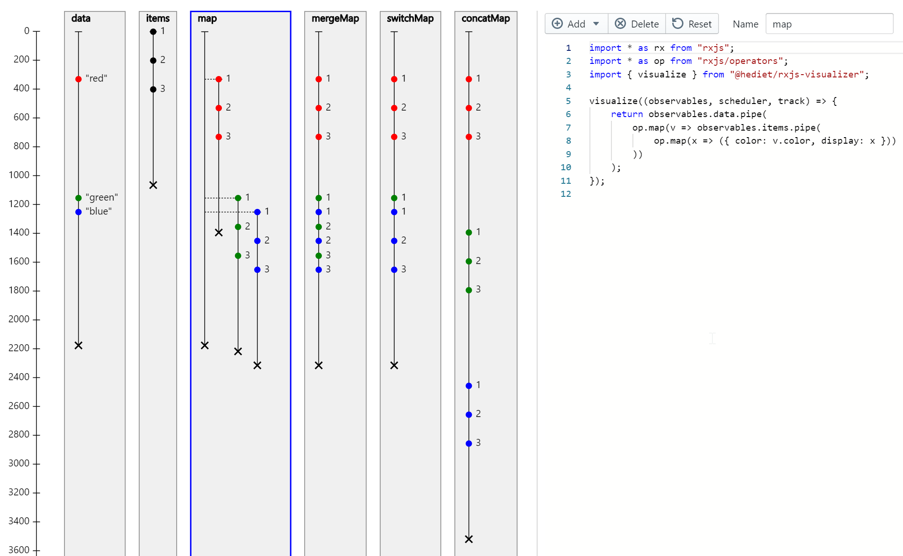

# A TypeScript Playground for RX JS

This is a playground for
[RxJS](https://rxjs-dev.firebaseapp.com/), a
library for reactive programming using Observables that
make it easier to compose asynchronous or callback-based
code. The playground supports editable as well as
computed observables. Events of editable observables can
be created with a single click and dragged around, while
computed observables are expressed in type-checked
JavaScript (also known as TypeScript) and can refer to
other observables.



Core of this playground is the RxJs
`VirtualTimeScheduler`
that is used to immediately process delayed observables.
The [Monaco Editor](https://microsoft.github.io/monaco-editor/) is used as editor component. The control UI is
implemented with [BlueprintJs](https://blueprintjs.com/), the
visualization is rendered as plain SVG.

For technical reasons, delayed Rx operations must be
given the scheduler passed to the `visualize` function.
The `track` function can be used to track piped (intermediate) observables.
The browser url reflects the current playground model
and can be used for sharing.

## Dev-Setup

Clone the project and run yarn:

```
git clone https://github.com/hediet/rxjs-playground.git
cd rxjs-playground
yarn
```

### Dev-Server

To start the dev server, run:

```
yarn dev
```

and open `http://localhost:8080`.

### Architecture

This is a rough overview of the architecture of this app:


### Todos

-   Improve performance
-   Improve usability
